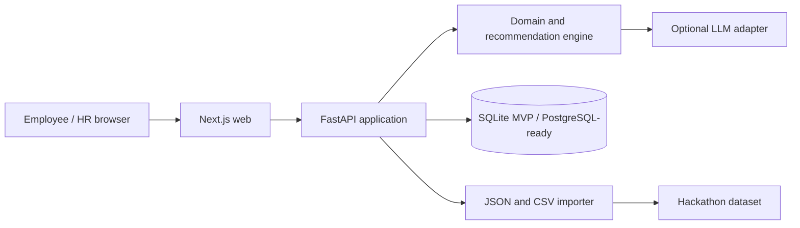
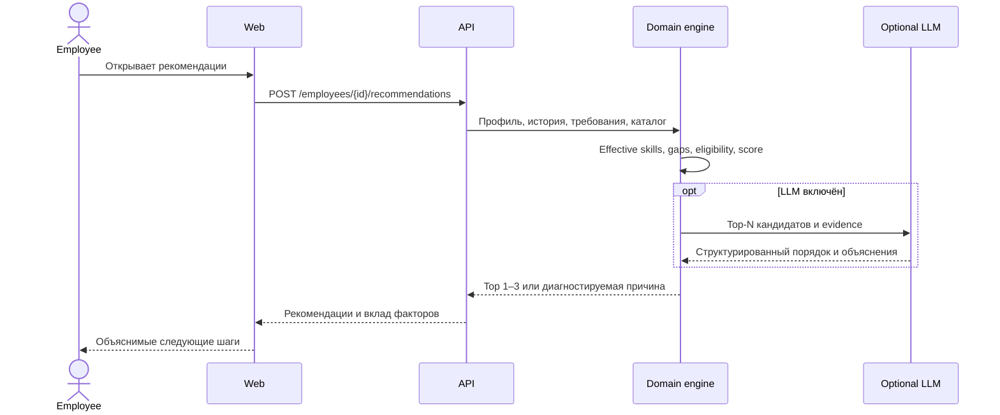

# Архитектура Career Quest

## Цель

Система должна предложить сотруднику следующий достижимый шаг развития, объяснить рекомендацию через факты профиля и пересчитать прогресс после выполнения. HR получает только необходимые агрегаты и разрешённый drill-down.

## Принципы

- Доменная логика детерминирована и тестируется без LLM.
- LLM работает только с отфильтрованными кандидатами и структурированными доказательствами.
- Recommendation engine не использует правило одного минимального навыка.
- Исходная оценка навыков неизменяема; текущие уровни вычисляются из неё и последующих завершений.
- Приложение запускается и выдаёт fallback-рекомендации без внешнего AI-ключа.
- Персональная история недоступна другим сотрудникам.
- Базовая версия не содержит публичных рейтингов и геймификации обязательных процессов.

## Контейнеры



## Модули backend

```text
api
├── api              HTTP routes, DTO, RBAC, error mapping
├── application      use cases and transaction boundaries
├── domain           grades, effective skills, gaps, eligibility, scoring
└── infrastructure   repositories, loaders, LLM provider, cache
```

Доменный слой не зависит от FastAPI, базы данных или конкретного LLM-провайдера.

## Поток рекомендации



## Recommendation engine

Первый вариант использует конфигурируемые факторы:

| Фактор | Вес |
|---|---:|
| Реальное закрытие разрывов | 40% |
| Покрытие критичных навыков | 20% |
| Соответствие карьерной цели | 15% |
| История участия | 15% |
| Доступность | 5% |
| Реалистичность трудозатрат | 5% |

Перед scoring выполняются жёсткие проверки: обязательность, аудитория, prerequisites, повторное завершение, активный `in_progress`, наличие будущей сессии и фактический skill gain.

LLM не может добавлять кандидатов или обходить эти правила. Невалидный ответ, timeout или отсутствие ключа приводят к детерминированному fallback.

## Хранение данных

Для MVP используется SQLite. Доступ к данным скрывается за repository interfaces, чтобы production-вариант мог перейти на PostgreSQL без изменения домена.

Основные сущности:

- Employee и CareerGoal;
- Skill и RoleProfile;
- DevelopmentEvent, EventSkillGain и EventPrerequisite;
- неизменяемая оценка навыков;
- ActivityRecord;
- RecommendationRun и RecommendationItem;
- ImportBatch и ImportError.

Seed импортируется идемпотентно. Новые завершения и проверочные профили сохраняются отдельно; исходные файлы не перезаписываются.

## Безопасность

- `employee` читает только собственный профиль, историю и рекомендации.
- `hr` получает агрегаты, импорт и разрешённый drill-down.
- Проверка прав выполняется в API.
- LLM получает обезличенные признаки вместо ФИО.
- В логах нет полных профилей, но есть correlation ID, длительность, версия scoring и факт fallback.

## Производительность

- Профиль и обычные API-запросы: до 2 секунд.
- LLM-рекомендация: timeout 10 секунд.
- Результат кэшируется по состоянию сотрудника, каталога и конфигурации.
- Завершение активности инвалидирует соответствующий кэш.

## Осознанно отложено

- vector database;
- message broker;
- отдельные микросервисы;
- agent framework;
- публичные рейтинги;
- награды и внутренняя валюта;
- production SSO и корпоративные интеграции.
