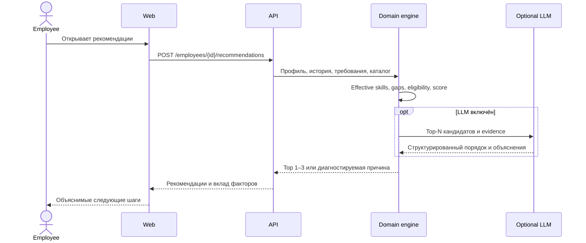

# Архитектура Career Quest

## Цель

Система должна предложить сотруднику следующий достижимый шаг развития, объяснить рекомендацию через факты профиля и пересчитать прогресс после выполнения. HR получает только необходимые агрегаты и разрешённый drill-down.

## Принципы

- Доменная логика детерминирована и тестируется без LLM.
- LLM работает только с отфильтрованными кандидатами и структурированными доказательствами.
- Recommendation engine не использует правило одного минимального навыка.
- Исходная оценка навыков неизменяема; текущие уровни вычисляются из неё и последующих завершений.
- Приложение запускается и выдаёт fallback-рекомендации без внешнего AI-ключа.
- Персональная история ограничена только spoofable demo-заголовками в текущем MVP; production-защита не реализована.
- Базовая версия не содержит публичных рейтингов и геймификации обязательных процессов.

## Контейнеры


## Модули backend

```text
api
├── api              HTTP routes, DTO, RBAC, error mapping
├── application      use cases and transaction boundaries
├── domain           grades, effective skills, gaps, eligibility, scoring
└── infrastructure   repositories, loaders, LLM provider, cache
```

Доменный слой не зависит от FastAPI, базы данных или конкретного LLM-провайдера.

## Поток рекомендации



## Recommendation engine

Первый вариант использует конфигурируемые факторы:

| Фактор | Вес |
|---|---:|
| Реальное закрытие разрывов | 40% |
| Покрытие критичных навыков | 20% |
| Соответствие карьерной цели | 15% |
| История участия | 15% |
| Доступность | 5% |
| Реалистичность трудозатрат | 5% |

Перед scoring выполняются жёсткие проверки: обязательность, аудитория, prerequisites, повторное завершение, активный `in_progress`, наличие будущей сессии и фактический skill gain.

LLM не может добавлять кандидатов или обходить эти правила. Невалидный ответ, timeout или отсутствие ключа приводят к детерминированному fallback.

## Хранение данных

Текущий core flow читает неизменяемый seed и восстанавливает поверх него сохранённые завершения и импортированные профили/историю из SQLite. Apply импортного пакета записывает данные атомарно и сразу активирует их в текущем снимке; при следующем запуске снимок повторно строится из seed и SQLite. Compose хранит БД в `career_quest_runtime`; путь задаётся через `DATABASE_URL`.

Основные сущности:

- Employee и CareerGoal;
- Skill и RoleProfile;
- DevelopmentEvent, EventSkillGain и EventPrerequisite;
- неизменяемая оценка навыков;
- ActivityRecord;
- RecommendationRun и RecommendationItem;
- ImportBatch и ImportError.

Seed загружается детерминированно. Новые завершения сохраняются отдельно; исходные файлы не перезаписываются.

## Безопасность

- API применяет demo dependency: `employee` ограничен переданным `X-Employee-Id`, а список сотрудников и HR-агрегаты требуют роль `hr`.
- Demo-заголовки не являются аутентификацией и могут быть выставлены любым клиентом. Seed и endpoints предназначены только для локального демо; перед доступом к реальным данным нужны доверенный identity provider и привязка employee ID/HR-роли к проверенной identity.
- Маршруты импорта validate/apply доступны только с demo-ролью `hr`; сама demo-роль не подтверждает identity и подходит только для локальной разработки.
- Перед production требуется подключить доверенный identity provider, закрыть доступ к персональным данным и проверить logging/privacy поведение.

## Производительность

- Профиль и обычные API-запросы: до 2 секунд.
- LLM-рекомендация: timeout 10 секунд.
- Результат кэшируется по состоянию сотрудника, каталога и конфигурации.
- Завершение активности инвалидирует соответствующий кэш.

## Осознанно отложено

- vector database;
- message broker;
- отдельные микросервисы;
- agent framework;
- публичные рейтинги;
- награды и внутренняя валюта;
- production SSO и корпоративные интеграции.
