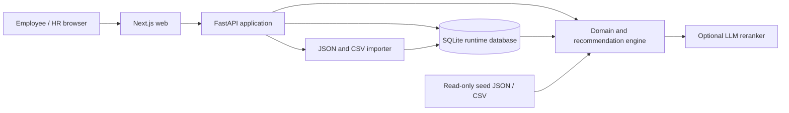
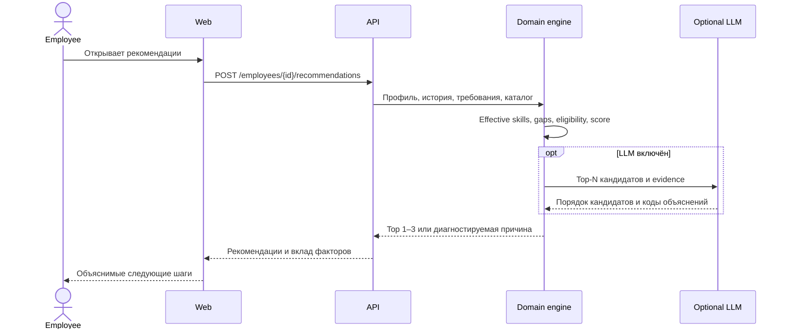

# Архитектура Career Quest

## Цель

Система должна предложить сотруднику следующий достижимый шаг развития, объяснить рекомендацию через факты профиля и пересчитать прогресс после выполнения. HR получает только необходимые агрегаты и разрешённый drill-down.

## Принципы

- Доменная логика детерминирована и тестируется без LLM.
- LLM работает только с отфильтрованными кандидатами и структурированными доказательствами.
- Recommendation engine не использует правило одного минимального навыка.
- Исходная оценка навыков неизменяема; текущие уровни вычисляются из неё и последующих завершений.
- Приложение запускается и выдаёт fallback-рекомендации без внешнего AI-ключа.
- API сопоставляет Bearer-токены из серверной конфигурации с ролью и employee ID. Employee-токен ограничен одним сотрудником; HR-токен даёт доступ к списку, аналитике и импорту. Demo-токены не заменяют production identity provider.
- Базовая версия не содержит публичных рейтингов и геймификации обязательных процессов.

## Контейнеры



## Модули backend

```text
api
├── api              HTTP routes, DTO, RBAC, error mapping
├── application      use cases and transaction boundaries
├── domain           grades, effective skills, gaps, eligibility, scoring
└── infrastructure   repositories, loaders, LLM provider, cache
```

Доменный слой не зависит от FastAPI, базы данных или конкретного LLM-провайдера.

## Поток рекомендации



## Recommendation engine

Первый вариант использует конфигурируемые факторы:

| Фактор | Вес |
|---|---:|
| Реальное закрытие разрывов | 40% |
| Покрытие критичных навыков | 20% |
| Соответствие карьерной цели | 15% |
| История участия | 15% |
| Доступность | 5% |
| Реалистичность трудозатрат | 5% |

Перед scoring выполняются жёсткие проверки: обязательность, аудитория, prerequisites, повторное завершение, активный `in_progress`, наличие будущей сессии и фактический skill gain.

LLM не может добавлять кандидатов или обходить эти правила. Перестановка разрешена только внутри диапазона в 5 deterministic score points, а объяснения полностью формируются детерминированным движком. Невалидный ответ, timeout или отсутствие ключа приводят к fallback. В outbound payload нет ФИО и `employee_id`; process-local cache ограничен по TTL и размеру и объединяет одинаковые параллельные запросы.

## Хранение данных

Текущий core flow читает неизменяемый seed и накладывает сохранённые завершения и импортированные профили/историю из SQLite. Apply импортного пакета записывает данные атомарно, увеличивает `dataset_revision` и активирует их в текущем снимке. Другие worker-процессы при следующем dependency resolution замечают ревизию и пересобирают bundle из seed + overlay. Compose хранит БД в `career_quest_runtime`; путь задаётся через `DATABASE_URL`. Переменная `AS_OF_DATE` не переопределяет расчётную дату: она берётся из metadata seed-набора.

SQLite остаётся локальным single-host хранилищем. Для production/multi-region целевая граница — PostgreSQL с миграциями и транзакционным `active_dataset_version`; исходные upload-файлы должны проходить quarantine/validation в object storage. Агент получает только узкие read-only backend tools и не получает SQL либо bucket credentials.

Основные сущности:

- Employee и CareerGoal;
- Skill и RoleProfile;
- DevelopmentEvent, EventSkillGain и EventPrerequisite;
- неизменяемая оценка навыков;
- ActivityRecord;
- RecommendationItem; `RecommendationRun` с usage/model/prompt/scoring version остаётся production-задачей;
- ImportBatch и ImportError.

Seed загружается детерминированно. Новые завершения сохраняются отдельно; исходные файлы не перезаписываются.

## Безопасность

- API сопоставляет Bearer-токены из серверной конфигурации с ролью и employee ID. Employee-токен ограничен одним сотрудником и только он может отмечать его активности выполненными; HR-токен даёт read-only drill-down, доступ к списку, аналитике и импорту.
- Demo-токены не доказывают корпоративную личность. Не используйте их с реальными персональными данными.
- При `APP_ENV=production|staging|cloud` или `VERCEL=1` demo auth запрещён по умолчанию. Временный access-gated demo требует осознанного `ALLOW_INSECURE_DEMO_AUTH=true`; это не заменяет OIDC/JWT.
- Маршруты импорта validate/apply доступны только с HR Bearer-токеном.
- Перед production требуется подключить доверенный identity provider, закрыть доступ к персональным данным и проверить logging/privacy поведение.

## Производительность

- Целевые ограничения ТЗ: обычный отклик до 2 секунд, LLM-запрос до 10 секунд. Это требования, а не опубликованные результаты нагрузочного тестирования.
- Для LLM adapter задан timeout не более 10 секунд; реальную задержку следует проверять в целевой среде.
- Результат кэшируется по обезличенному evidence hash, модели и версии prompt; TTL и LRU ограничивают время жизни и размер.
- Изменение состояния создаёт новый cache key; старые записи удаляются по TTL/LRU.

## Осознанно отложено

- vector database;
- message broker;
- отдельные микросервисы;
- agent framework;
- публичные рейтинги;
- награды и внутренняя валюта;
- production OIDC/JWT, PostgreSQL/object storage и корпоративные интеграции;
- персистентный `RecommendationRun` audit с retention и correlation ID.
